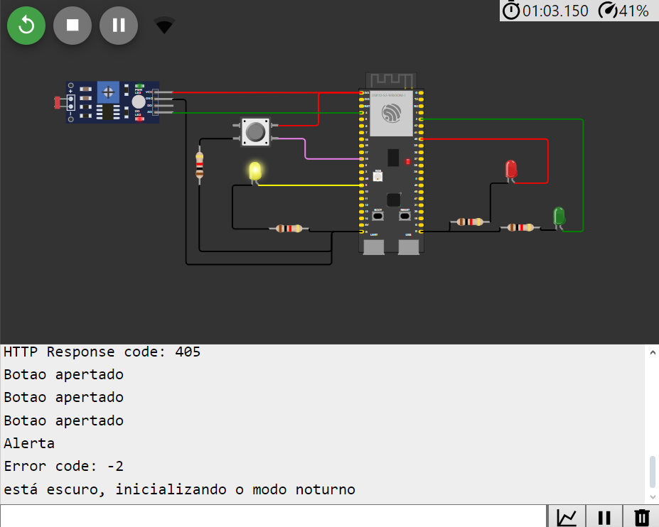

# prova

O sistema tem principalmente 4 estados:
  - modo noturno: o led amarelo fica piscando a cada 1 segundo
  
  

  - led verde ligado- o led verde fica ligado por 3 segundos
  
  - led amarelo ligado - o led fica ligado por 2 segundos
  
  - led vermelho ligado - o led fica ligado por 5 segundos
  
      - no led verde ligado, caso o botao seja pressionado o led fica ligado por um segundo apos o pressionamento
      
      - casso o botão seja apertado 3 vezes é enviado um alerta
      
